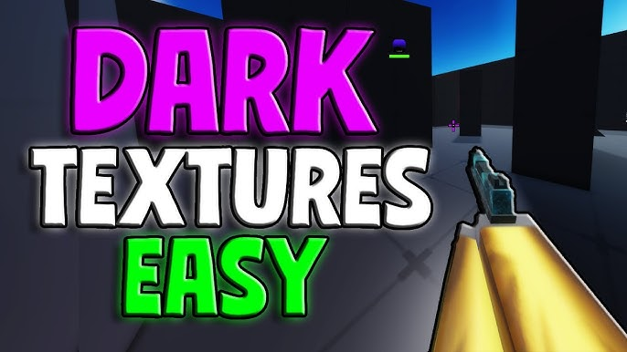

  

<h1 align="center">🌑 DARK TEXTURES 🌑</h1>

<h3 align="center">🖤 A Dark Roblox Texture Pack 🖤</h3>

Transform Roblox with darker, cleaner, and more immersive textures.

---

  
  
  
  
  

  

---

## 🌙 About

A texture replacement pack that transforms Roblox’s default visuals into a darker, cleaner aesthetic for a more modern and immersive experience.

---

## ✨ Features

- 🌑 Dark, modern textures  
- ⚡ Simple installation  
- 🎮 Fully Roblox compatible  
- 🔄 Easy to revert anytime  
- 🖤 Clean, minimal aesthetic  

---

## 📸 Screenshots

  
  
  

---

## 📥 Installation

### 1. Download
Get the latest release from the button above.

### 2. Locate Roblox Folder
Navigate to:
Roblox
└── Versions
└── version-xxxxxxxxxxxx
└── PlatformContent
└── pc
└── textures

### 3. Copy Files
Copy everything inside the `Dark Textures` folder.

### 4. Paste
Paste into:
PlatformContent\pc\textures

### 5. Replace Files
Click **Replace All** when prompted.

### 6. Restart Roblox
Launch Roblox again to apply changes.

🎉 Done!

---

## ⚠️ Disclaimer

- No exploits or cheats included  
- No scripts or injections  
- Pure texture replacement only  
- Roblox updates may overwrite files  

---

## ❤️ Support

- ⭐ Star the repo  
- 🍴 Fork it  
- 🐛 Report issues  
- 💡 Suggest improvements  

---

  <b>🌑 Thank you for using Dark Textures 🌑</b> 
  🖤 Enjoy a darker Roblox experience 🖤

